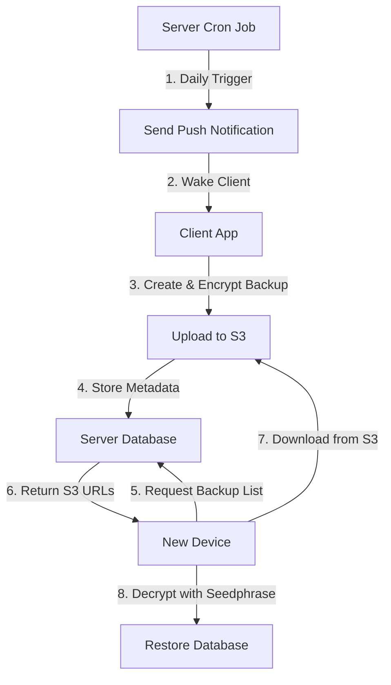

# Encrypted Database Backup Architecture

## Overview

This document outlines the architecture for implementing encrypted database backups in the Noah wallet system. The solution provides automatic daily backups of the client's SQLite database, encrypted with the user's seedphrase, and stored securely in cloud storage.

## Key Requirements

- **Daily automatic backups** triggered by server push notifications
- **Maximum 2 backups per user** (rolling replacement)
- **Client-side encryption** using seedphrase (server cannot decrypt)
- **Device switching support** for backup restoration
- **Privacy-first design** - server stores only metadata, backups in S3
- **Cost-effective storage** using S3 instead of expensive Turso database

## System Architecture

### High-Level Data Flow



### Security Model

1. **Client-Side Encryption**: Database is encrypted using AES-256-GCM with key derived from seedphrase
2. **Server Blindness**: Server only stores metadata, S3 stores encrypted blobs
3. **Authentication**: Uses existing LNURL-auth system with public key signatures
4. **Key Derivation**: PBKDF2 with salt derived from public key for deterministic encryption
5. **S3 Security**: Pre-signed URLs with short expiration, encrypted at rest

## Component Design

### 1. Server-Side Components

#### Database Schema

```sql
-- Lightweight metadata table (no large blobs in Turso)
CREATE TABLE backup_metadata (
    id INTEGER PRIMARY KEY AUTOINCREMENT,
    pubkey TEXT NOT NULL,
    s3_key TEXT NOT NULL,           -- S3 object key
    backup_size INTEGER NOT NULL,
    created_at TIMESTAMP DEFAULT CURRENT_TIMESTAMP,
    backup_version INTEGER NOT NULL DEFAULT 1,
    FOREIGN KEY (pubkey) REFERENCES users(pubkey),
    UNIQUE(pubkey, backup_version)
);

CREATE INDEX idx_backup_metadata_pubkey ON backup_metadata(pubkey);
CREATE INDEX idx_backup_metadata_created_at ON backup_metadata(created_at);

-- User backup preferences
CREATE TABLE backup_settings (
    pubkey TEXT PRIMARY KEY,
    backup_enabled BOOLEAN NOT NULL DEFAULT FALSE,
    last_backup_at TIMESTAMP,
    FOREIGN KEY (pubkey) REFERENCES users(pubkey)
);
```

#### API Endpoints

**Get Upload URL** - `POST /v0/backup/upload_url`

```rust
pub struct GetUploadUrlPayload {
    pub backup_version: i32,   // 1 or 2 (rolling)
    pub backup_size: i64,      // For validation
}

pub struct UploadUrlResponse {
    pub upload_url: String,    // Pre-signed S3 URL
    pub s3_key: String,        // S3 object key
}
```

**Complete Upload** - `POST /v0/backup/complete_upload`

```rust
pub struct CompleteUploadPayload {
    pub s3_key: String,
    pub backup_version: i32,
    pub backup_size: i64,
}
```

**List Backups** - `POST /v0/backup/list`

```rust
pub struct BackupInfo {
    pub backup_version: i32,
    pub created_at: String,
    pub backup_size: i64,
}
```

**Get Download URL** - `POST /v0/backup/download_url`

```rust
pub struct GetDownloadUrlPayload {
    pub backup_version: Option<i32>, // None = latest
}

pub struct DownloadUrlResponse {
    pub download_url: String,  // Pre-signed S3 URL
    pub backup_size: i64,
}
```

**Delete Backup** - `POST /v0/backup/delete`

```rust
pub struct DeleteBackupPayload {
    pub backup_version: i32,
}
```

**Update Backup Settings** - `POST /v0/backup/settings`

```rust
pub struct BackupSettingsPayload {
    pub backup_enabled: bool,
}
```

### 2. Client-Side Components

#### Native Encryption Service (via noah-tools)

```typescript
// Add to client/nitromodules/noah-tools/src/index.tsx
interface BackupEncryptionService {
  encryptBackup(backupPath: string, seedphrase: string): Promise<string>; // Returns base64 encrypted data
  decryptBackup(
    encryptedData: string,
    seedphrase: string,
    outputPath: string
  ): Promise<string>; // Returns output path
}
```

#### Push Notification Handler

```typescript
interface BackupNotificationHandler {
  handleBackupNotification(): Promise<Result<void, Error>>;
  triggerManualBackup(): Promise<Result<void, Error>>;
}
```

#### Backup Manager Hook

```typescript
interface UseBackupManager {
  isBackupEnabled: boolean;
  setBackupEnabled: (enabled: boolean) => void;
  triggerBackup: () => Promise<Result<void, Error>>;
  listBackups: () => Promise<Result<BackupInfo[], Error>>;
  restoreBackup: (version?: number) => Promise<Result<void, Error>>;
  deleteBackup: (version: number) => Promise<Result<void, Error>>;
}
```

## Detailed Implementation Plan

### Phase 1: Server Infrastructure

#### File: `server/src/s3_client.rs`

New S3 client wrapper:

```rust
use aws_sdk_s3::{Client, Config, Credentials, Region};

pub struct S3BackupClient {
    client: Client,
    bucket: String,
}

impl S3BackupClient {
    pub async fn new() -> Result<Self, anyhow::Error> {
        // Initialize S3 client with credentials
    }

    pub async fn generate_upload_url(&self, key: &str) -> Result<String, anyhow::Error> {
        // Generate pre-signed upload URL
    }

    pub async fn generate_download_url(&self, key: &str) -> Result<String, anyhow::Error> {
        // Generate pre-signed download URL
    }

    pub async fn delete_object(&self, key: &str) -> Result<(), anyhow::Error> {
        // Delete S3 object
    }
}
```

#### File: `server/src/migrations.rs`

Add new migration for backup tables:

```rust
r#"
CREATE TABLE backup_metadata (
    id INTEGER PRIMARY KEY AUTOINCREMENT,
    pubkey TEXT NOT NULL,
    s3_key TEXT NOT NULL,
    backup_size INTEGER NOT NULL,
    created_at TIMESTAMP DEFAULT CURRENT_TIMESTAMP,
    backup_version INTEGER NOT NULL DEFAULT 1,
    FOREIGN KEY (pubkey) REFERENCES users(pubkey),
    UNIQUE(pubkey, backup_version)
);

CREATE INDEX idx_backup_metadata_pubkey ON backup_metadata(pubkey);
CREATE INDEX idx_backup_metadata_created_at ON backup_metadata(created_at);

CREATE TABLE backup_settings (
    pubkey TEXT PRIMARY KEY,
    backup_enabled BOOLEAN NOT NULL DEFAULT FALSE,
    last_backup_at TIMESTAMP,
    FOREIGN KEY (pubkey) REFERENCES users(pubkey)
);
"#
```

#### File: `server/src/gated_api_v0.rs`

Add backup endpoints:

- `get_upload_url()`
- `complete_upload()`
- `list_backups()`
- `get_download_url()`
- `delete_backup()`
- `update_backup_settings()`

#### File: `server/src/cron.rs`

Add daily backup notification job:

```rust
pub async fn send_backup_notifications(app_state: AppState) -> anyhow::Result<()> {
    // Query users with backup_enabled = true
    // Send push notification to trigger backup
}
```

### Phase 2: Native Encryption System

#### File: `client/nitromodules/noah-tools/src/index.tsx`

Add native encryption methods:

```typescript
import { NitroModules } from "react-native-nitro-modules";

// Add to existing exports
function encryptBackup(
  backupPath: string,
  seedphrase: string
): Promise<string> {
  return NoahToolsHybridObject.encryptBackup(backupPath, seedphrase);
}

function decryptBackup(
  encryptedData: string,
  seedphrase: string,
  outputPath: string
): Promise<string> {
  return NoahToolsHybridObject.decryptBackup(
    encryptedData,
    seedphrase,
    outputPath
  );
}

export { encryptBackup, decryptBackup };
```

#### File: `client/nitromodules/noah-tools/ios/NoahTools.swift`

Add Swift implementation:

```swift
import Foundation
import CryptoKit
import CommonCrypto

@objc(NoahTools)
class NoahTools: NSObject {

    @objc
    func encryptBackup(_ backupPath: String, seedphrase: String, resolve: @escaping RCTPromiseResolveBlock, reject: @escaping RCTPromiseRejectBlock) {
        DispatchQueue.global(qos: .background).async {
            do {
                // Read backup file
                let backupData = try Data(contentsOf: URL(fileURLWithPath: backupPath))

                // Derive key from seedphrase using PBKDF2
                let salt = self.deriveSalt(from: seedphrase)
                let key = try self.deriveKey(from: seedphrase, salt: salt)

                // Generate random IV
                let iv = self.generateRandomBytes(count: 12)

                // Encrypt using AES-256-GCM
                let sealedBox = try AES.GCM.seal(backupData, using: key, nonce: AES.GCM.Nonce(data: iv))

                // Combine IV + encrypted data + auth tag
                var encryptedData = Data()
                encryptedData.append(iv)
                encryptedData.append(sealedBox.ciphertext)
                encryptedData.append(sealedBox.tag)

                // Return base64 encoded
                let base64Result = encryptedData.base64EncodedString()
                DispatchQueue.main.async {
                    resolve(base64Result)
                }
            } catch {
                DispatchQueue.main.async {
                    reject("ENCRYPTION_ERROR", "Failed to encrypt backup: \(error.localizedDescription)", error)
                }
            }
        }
    }

    @objc
    func decryptBackup(_ encryptedData: String, seedphrase: String, outputPath: String, resolve: @escaping RCTPromiseResolveBlock, reject: @escaping RCTPromiseRejectBlock) {
        DispatchQueue.global(qos: .background).async {
            do {
                // Decode base64
                guard let data = Data(base64Encoded: encryptedData) else {
                    throw NSError(domain: "DecryptionError", code: 1, userInfo: [NSLocalizedDescriptionKey: "Invalid base64 data"])
                }

                // Extract IV, ciphertext, and auth tag
                let iv = data.prefix(12)
                let ciphertext = data.dropFirst(12).dropLast(16)
                let tag = data.suffix(16)

                // Derive key from seedphrase
                let salt = self.deriveSalt(from: seedphrase)
                let key = try self.deriveKey(from: seedphrase, salt: salt)

                // Decrypt using AES-256-GCM
                let sealedBox = try AES.GCM.SealedBox(nonce: AES.GCM.Nonce(data: iv), ciphertext: ciphertext, tag: tag)
                let decryptedData = try AES.GCM.open(sealedBox, using: key)

                // Write to output path
                try decryptedData.write(to: URL(fileURLWithPath: outputPath))

                DispatchQueue.main.async {
                    resolve(outputPath)
                }
            } catch {
                DispatchQueue.main.async {
                    reject("DECRYPTION_ERROR", "Failed to decrypt backup: \(error.localizedDescription)", error)
                }
            }
        }
    }

    private func deriveKey(from seedphrase: String, salt: Data) throws -> SymmetricKey {
        let seedData = seedphrase.data(using: .utf8)!
        let derivedKey = try self.pbkdf2(password: seedData, salt: salt, iterations: 10000, keyLength: 32)
        return SymmetricKey(data: derivedKey)
    }

    private func deriveSalt(from seedphrase: String) -> Data {
        // Use first 16 bytes of SHA256 hash of seedphrase as deterministic salt
        let seedData = seedphrase.data(using: .utf8)!
        let hash = SHA256.hash(data: seedData)
        return Data(hash.prefix(16))
    }

    private func generateRandomBytes(count: Int) -> Data {
        var bytes = Data(count: count)
        let result = bytes.withUnsafeMutableBytes { SecRandomCopyBytes(kSecRandomDefault, count, $0.baseAddress!) }
        guard result == errSecSuccess else {
            fatalError("Failed to generate random bytes")
        }
        return bytes
    }

    private func pbkdf2(password: Data, salt: Data, iterations: Int, keyLength: Int) throws -> Data {
        var derivedKey = Data(count: keyLength)
        let result = derivedKey.withUnsafeMutableBytes { derivedKeyBytes in
            salt.withUnsafeBytes { saltBytes in
                password.withUnsafeBytes { passwordBytes in
                    CCKeyDerivationPBKDF(
                        CCPBKDFAlgorithm(kCCPBKDF2),
                        passwordBytes.baseAddress, password.count,
                        saltBytes.baseAddress, salt.count,
                        CCPseudoRandomAlgorithm(kCCPRFHmacAlgSHA256),
                        UInt32(iterations),
                        derivedKeyBytes.baseAddress, keyLength
                    )
                }
            }
        }

        guard result == kCCSuccess else {
            throw NSError(domain: "CryptoError", code: Int(result), userInfo: [NSLocalizedDescriptionKey: "Key derivation failed"])
        }

        return derivedKey
    }
}
```

#### File: `client/nitromodules/noah-tools/android/src/main/java/com/margelo/nitro/noahtools/NoahTools.kt`

Add Kotlin implementation:

```kotlin
package com.margelo.nitro.noahtools

import android.util.Base64
import java.io.File
import java.security.SecureRandom
import javax.crypto.Cipher
import javax.crypto.spec.GCMParameterSpec
import javax.crypto.spec.SecretKeySpec
import javax.crypto.spec.PBEKeySpec
import javax.crypto.SecretKeyFactory
import java.security.MessageDigest

class NoahTools {

    fun encryptBackup(backupPath: String, seedphrase: String): String {
        try {
            // Read backup file
            val backupData = File(backupPath).readBytes()

            // Derive key from seedphrase using PBKDF2
            val salt = deriveSalt(seedphrase)
            val key = deriveKey(seedphrase, salt)

            // Generate random IV
            val iv = ByteArray(12)
            SecureRandom().nextBytes(iv)

            // Encrypt using AES-256-GCM
            val cipher = Cipher.getInstance("AES/GCM/NoPadding")
            val secretKey = SecretKeySpec(key, "AES")
            val gcmSpec = GCMParameterSpec(128, iv)
            cipher.init(Cipher.ENCRYPT_MODE, secretKey, gcmSpec)

            val encryptedData = cipher.doFinal(backupData)

            // Combine IV + encrypted data (GCM includes auth tag)
            val result = iv + encryptedData

            // Return base64 encoded
            return Base64.encodeToString(result, Base64.NO_WRAP)
        } catch (e: Exception) {
            throw Exception("Failed to encrypt backup: ${e.message}", e)
        }
    }

    fun decryptBackup(encryptedData: String, seedphrase: String, outputPath: String): String {
        try {
            // Decode base64
            val data = Base64.decode(encryptedData, Base64.NO_WRAP)

            // Extract IV and ciphertext
            val iv = data.sliceArray(0..11)
            val ciphertext = data.sliceArray(12 until data.size)

            // Derive key from seedphrase
            val salt = deriveSalt(seedphrase)
            val key = deriveKey(seedphrase, salt)

            // Decrypt using AES-256-GCM
            val cipher = Cipher.getInstance("AES/GCM/NoPadding")
            val secretKey = SecretKeySpec(key, "AES")
            val gcmSpec = GCMParameterSpec(128, iv)
            cipher.init(Cipher.DECRYPT_MODE, secretKey, gcmSpec)

            val decryptedData = cipher.doFinal(ciphertext)

            // Write to output path
            File(outputPath).writeBytes(decryptedData)

            return outputPath
        } catch (e: Exception) {
            throw Exception("Failed to decrypt backup: ${e.message}", e)
        }
    }

    private fun deriveKey(seedphrase: String, salt: ByteArray): ByteArray {
        val spec = PBEKeySpec(seedphrase.toCharArray(), salt, 10000, 256)
        val factory = SecretKeyFactory.getInstance("PBKDF2WithHmacSHA256")
        return factory.generateSecret(spec).encoded
    }

    private fun deriveSalt(seedphrase: String): ByteArray {
        // Use first 16 bytes of SHA256 hash of seedphrase as deterministic salt
        val digest = MessageDigest.getInstance("SHA-256")
        val hash = digest.digest(seedphrase.toByteArray())
        return hash.sliceArray(0..15)
    }
}
```

#### File: `client/src/lib/backupService.ts`

Replace crypto-js implementation with native calls:

```typescript
import { encryptBackup, decryptBackup } from "noah-tools";
import { ResultAsync } from "neverthrow";
import * as RNFS from "@dr.pogodin/react-native-fs";

export class BackupService {
  async encryptBackupFile(
    backupPath: string,
    seedphrase: string
  ): Promise<Result<string, Error>> {
    return ResultAsync.fromPromise(
      encryptBackup(backupPath, seedphrase),
      (e) => e as Error
    );
  }

  async decryptBackupFile(
    encryptedData: string,
    seedphrase: string,
    outputPath: string
  ): Promise<Result<string, Error>> {
    return ResultAsync.fromPromise(
      decryptBackup(encryptedData, seedphrase, outputPath),
      (e) => e as Error
    );
  }
}
```

#### File: `client/src/hooks/useBackupManager.ts`

Main backup management hook with all backup operations.

#### File: `client/src/lib/backupNotificationHandler.ts`

Push notification handler for backup triggers:

```typescript
import { useEffect } from "react";
import messaging from "@react-native-firebase/messaging";

export const useBackupNotificationHandler = () => {
  useEffect(() => {
    const unsubscribe = messaging().onMessage(async (remoteMessage) => {
      if (remoteMessage.data?.type === "backup_trigger") {
        // Trigger backup process
        await handleBackupNotification();
      }
    });

    return unsubscribe;
  }, []);
};
```

### Phase 3: User Interface

#### File: `client/src/screens/BackupSettingsScreen.tsx`

New screen for backup management:

- Enable/disable automatic backups
- Manual backup trigger
- View backup history
- Restore from backup
- Delete backups

#### File: `client/src/components/BackupStatusCard.tsx`

Component showing backup status in main settings screen.

### Phase 4: Integration Points

#### Modify: `client/src/screens/SettingsScreen.tsx`

Add backup settings section with navigation to backup management.

#### Modify: `client/src/screens/OnboardingScreen.tsx`

Add backup setup during wallet creation flow.

#### Modify: `server/src/main.rs`

Register new backup routes in the gated API router.

## Security Considerations

### Native Encryption Details

- **Algorithm**: AES-256-GCM for authenticated encryption
- **Key Derivation**: PBKDF2 with 10,000 iterations using SHA-256
- **Salt Generation**: Deterministic salt from SHA-256 hash of seedphrase (first 16 bytes)
- **IV Generation**: Cryptographically secure random 12-byte IV for each encryption
- **Output Format**: Base64(IV + Ciphertext + AuthTag)

### S3 Security

- **Pre-signed URLs**: Short expiration (15 minutes for upload, 5 minutes for download)
- **Bucket Policy**: Restrict access to pre-signed URLs only
- **Encryption at Rest**: S3 server-side encryption enabled
- **Access Logging**: S3 access logs for audit trail

### Threat Model

1. **Server Compromise**: Only metadata exposed, encrypted blobs in S3
2. **S3 Compromise**: Encrypted blobs remain secure without seedphrase
3. **Network Interception**: HTTPS + encrypted payload provides double protection
4. **Client Compromise**: Seedphrase required for decryption
5. **Backup Integrity**: GCM provides authentication against tampering

### Privacy Guarantees

- Server cannot decrypt backup contents
- S3 cannot decrypt backup contents
- Server cannot correlate backup contents across users
- Backup metadata is minimal (size, timestamp, version, S3 key)

### Native Security Benefits

- **Hardware Security**: Leverages platform-specific secure enclaves and hardware crypto acceleration
- **Memory Safety**: Native implementations have better memory management for sensitive data
- **Crypto Libraries**: Uses battle-tested platform crypto libraries (CryptoKit on iOS, Android Keystore)
- **Performance**: Native crypto operations are significantly faster than JavaScript implementations

## Backup Process Flow

### Daily Automatic Backup (Push Notification Triggered)

1. Server cron job runs daily at configured time
2. Query users with `backup_enabled = true`
3. Send push notification with `type: 'backup_trigger'`
4. Client receives notification and wakes up
5. Client checks if backup is needed (not done today)
6. Create zip of noah-data directory (same as current export)
7. Encrypt zip with native seedphrase-derived key
8. Request pre-signed upload URL from server
9. Upload encrypted backup directly to S3
10. Notify server of successful upload completion
11. Server updates metadata in database
12. Clean up local temporary files

### Manual Backup

1. User triggers from settings screen
2. Show progress indicator
3. Follow same process as automatic backup (steps 6-12)
4. Show success/failure notification

### Restore Process

1. User enters seedphrase on new device
2. App authenticates with server using derived keypair
3. Request list of available backups
4. Request pre-signed download URL for chosen backup
5. Download encrypted backup directly from S3
6. Decrypt using native seedphrase implementation
7. Extract to noah-data directory
8. Initialize wallet with restored data

## Error Handling

### Client-Side Errors

- Network failures: Retry with exponential backoff
- Encryption failures: Log error, notify user
- Storage failures: Check available space, notify user

### Server-Side Errors

- Storage limits: Return appropriate error codes
- Authentication failures: Standard auth error handling
- Database errors: Log and return generic error

## Testing Strategy

### Unit Tests

- Encryption/decryption round-trip tests
- Key derivation consistency tests
- API endpoint tests with mock data

### Integration Tests

- Full backup/restore cycle tests
- Multi-device backup sharing tests
- Error scenario handling tests

### Security Tests

- Verify server cannot decrypt backups
- Test key derivation determinism
- Validate backup integrity checks

## Performance Considerations

### Client Performance

- Encrypt in background thread to avoid UI blocking
- Compress before encryption to reduce upload size
- Cache encryption keys during session

### Server Performance

- Implement backup size limits (e.g., 50MB max)
- Use streaming for large backup uploads/downloads
- Index optimization for backup queries

### Storage Optimization

- S3 lifecycle policies for automatic cleanup
- Compression of backup data before encryption
- S3 storage class optimization (Standard → IA → Glacier)
- Monitor S3 costs and usage per user

## Deployment Considerations

### Database Migration

- Add lightweight metadata tables to Turso
- Migrate any existing backup data to S3
- Ensure backward compatibility during rollout

### S3 Setup

- Create dedicated S3 bucket for backups
- Configure bucket policies and CORS
- Set up lifecycle policies for cost optimization
- Configure server-side encryption

### Feature Rollout

- Feature flag for backup functionality
- Gradual rollout to subset of users
- Monitor S3 costs and performance
- Monitor push notification delivery rates

### Monitoring

- Track backup success/failure rates
- Monitor S3 storage costs and usage
- Monitor push notification delivery success
- Alert on encryption/decryption failures
- Track backup restoration success rates

## Future Enhancements

### Potential Improvements

- Incremental backups to reduce bandwidth
- Multiple backup destinations (IPFS, user's cloud storage)
- Backup verification and integrity checks
- Cross-platform backup sharing

### Scalability Considerations

- Backup sharding across multiple storage backends
- CDN integration for backup downloads
- Backup deduplication for similar data patterns
